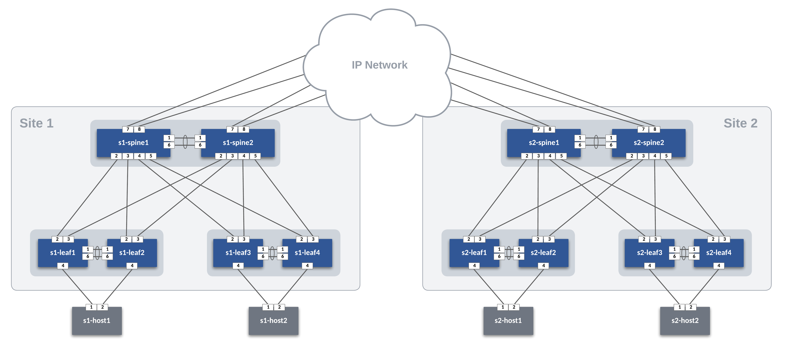

# ATD AVD Dual Data Center L2LS Design

## ATD Topology

Site 1

- vlan 10, 10.10.10.0/24
- vlan 20, 10.20.20.0/24

Site 2

- vlan 30, 10.30.30.0/24
- vlan 40, 10.40.40.0/24



## Clone this repo to ATD Programmability IDE

``` bash
cd /home/coder/project/labfiles
git clone https://github.com/mthiel117/atd-avd-dual-dc-l2ls.git
```

## ATD Lab Updates

Update AVD to latest version

``` bash
ansible-galaxy collection install arista.avd --force
```

Install Deepmerge module

``` bash
pip install deepmerge
```

## Initialize WAN environment

Push pre-defined configs for WAN Nodes

``` bash
make prepwan
```

## Build Site Configs

``` bash
# Build Site 1 Configs
make build-site-1

# Build Site 2 Configs
make build-site-2
```

## Deploy Site Configs

``` bash
# Build Site 1 Configs
make deploy-site-1

# Build Site 2 Configs
make deploy-site-2
```